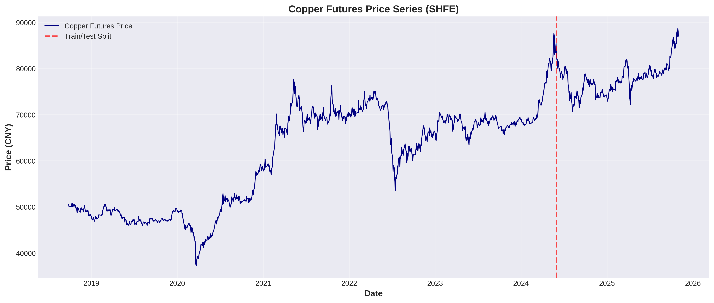
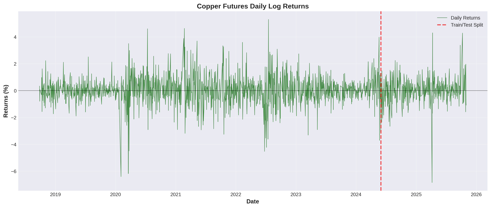
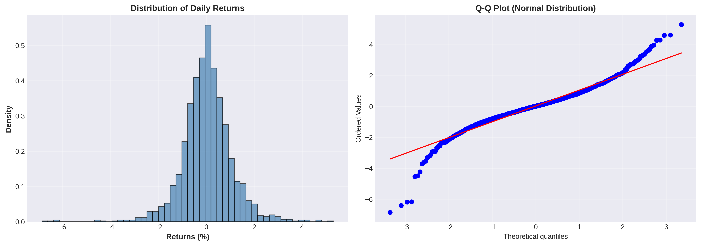
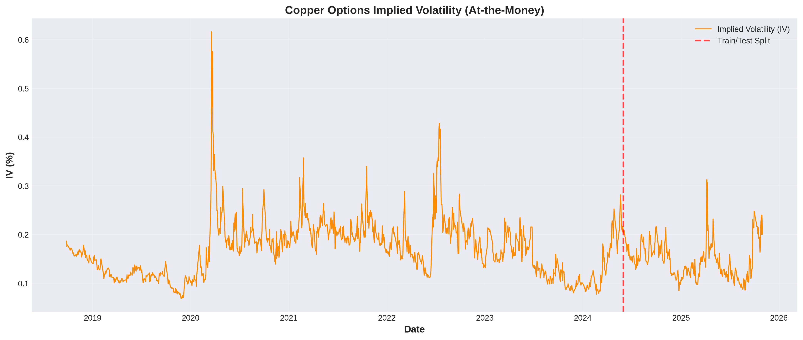
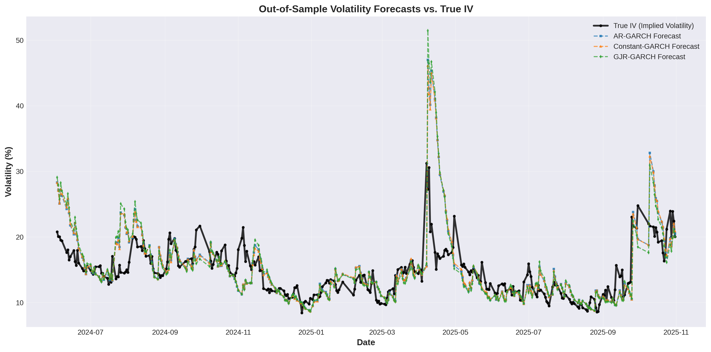
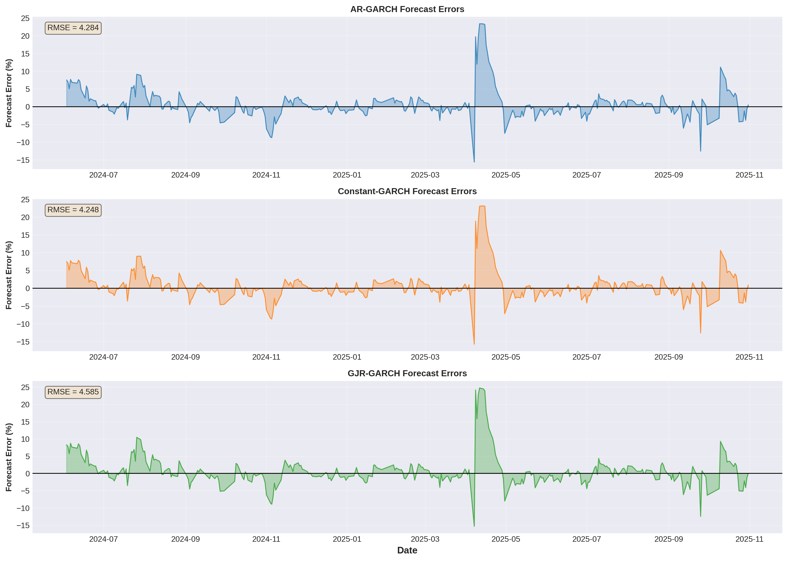
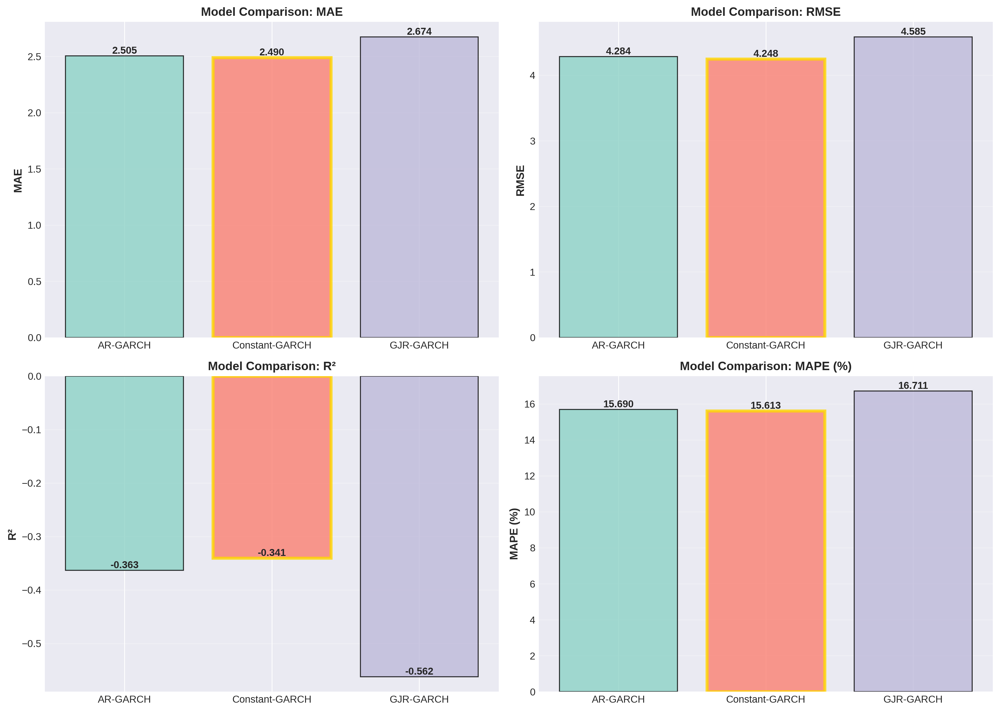
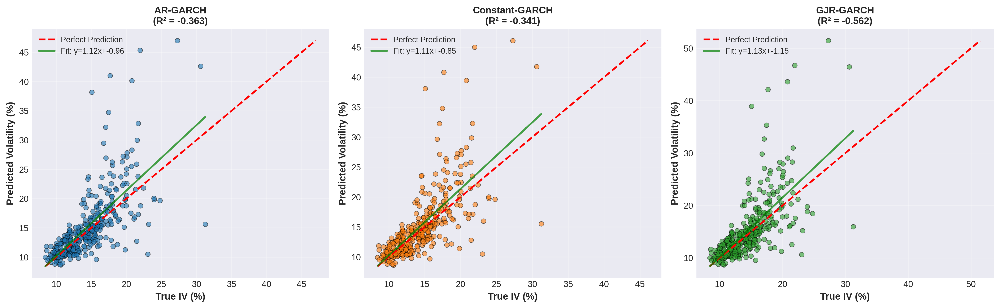

# GARCH Volatility Modeling Experiment Report

**Date:** 2025-11-12 05:12:10
**Target Asset:** Copper Futures (SHFE)
**Experiment Objective:** Model and forecast volatility using GARCH-class models, validated against option-implied volatility

---

## 1. Executive Summary

This experiment implements and compares three GARCH-class models for volatility forecasting of copper futures:
- **AR(1)-GARCH(1,1)**: GARCH with AR(1) mean equation
- **Constant-GARCH(1,1)**: Standard GARCH with constant mean
- **GJR-GARCH(1,1)**: Threshold GARCH capturing asymmetric effects

The models are estimated on in-sample data and evaluated on out-of-sample one-step-ahead forecasts. **Implied Volatility (IV) from at-the-money copper options serves as the true volatility benchmark**, following the experimental design requirement.

### Key Findings:
- **Best Model (RMSE):** Constant-GARCH
- **Best Model (MAE):** Constant-GARCH
- **Best Model (R²):** Constant-GARCH

---

## 2. Data Description

### 2.1 Dataset Information
- **Source:** Chinese commodity futures market data
- **Asset:** Copper futures main contract (CU.SHF)
- **Price Data Range:** 2018-09-26 to 2025-10-31
- **Total Observations:** 1719
- **Implied Volatility:** Calculated from at-the-money copper options

### 2.2 Sample Splitting
- **In-Sample (Training):** 2018-09-26 to 2024-05-31 (1375 obs, 80%)
- **Out-of-Sample (Testing):** 2024-06-03 to 2025-10-31 (344 obs, 20%)

### 2.3 Descriptive Statistics

**Daily Returns (%):**

|       |   Full Sample |    In-Sample |   Out-of-Sample |
|:------|--------------:|-------------:|----------------:|
| count |  1719         | 1375         |    344          |
| mean  |     0.0318107 |    0.0358983 |      0.0154723  |
| std   |     1.05368   |    1.07371   |      0.970798   |
| min   |    -6.84858   |   -6.40666   |     -6.84858    |
| 25%   |    -0.514027  |   -0.520068  |     -0.487836   |
| 50%   |     0.0234165 |    0.0294161 |      0.00625978 |
| 75%   |     0.563036  |    0.576557  |      0.497778   |
| max   |     5.29841   |    5.29841   |      4.30101    |

**Key Observations:**
- Mean return: 0.0318%
- Standard deviation: 1.0537%
- Skewness: -0.3066
- Kurtosis: 5.1080

The returns exhibit excess kurtosis (fat tails), which justifies the use of GARCH models for volatility clustering.

---

## 3. Methodology

### 3.1 Model Specifications

#### Model 1: AR(1)-GARCH(1,1)

**Mean Equation:**
```
r_t = μ + φ₁·r_(t-1) + ε_t
```

**Variance Equation:**
```
σ²_t = ω + α₁·ε²_(t-1) + β₁·σ²_(t-1)
```

This is the baseline GARCH model with first-order autoregression in the mean.

#### Model 2: Constant-GARCH(1,1)

**Mean Equation:**
```
r_t = μ + ε_t
```

**Variance Equation:**
```
σ²_t = ω + α₁·ε²_(t-1) + β₁·σ²_(t-1)
```

This is the standard GARCH(1,1) model with constant mean, the most widely used volatility model.

#### Model 3: GJR-GARCH

**Mean Equation:**
```
r_t = μ + φ₁·r_(t-1) + ε_t
```

**Variance Equation:**
```
σ²_t = ω + α₁·ε²_(t-1) + γ·I_(t-1)·ε²_(t-1) + β₁·σ²_(t-1)
```

where I_(t-1) = 1 if ε_(t-1) < 0, and 0 otherwise.

GJR-GARCH captures asymmetric volatility response (leverage effect).

### 3.2 Forecasting Procedure

**One-Step-Ahead Rolling Forecast:**
1. For each observation in the test set:
   - Re-estimate model using all data up to time t-1
   - Forecast volatility for time t
   - Compare forecast with true IV at time t
2. Annualize daily volatility forecasts: σ_annual = σ_daily × √250

### 3.3 Performance Metrics

Models are evaluated using:
- **MAE (Mean Absolute Error):** Average absolute deviation from true IV
- **RMSE (Root Mean Squared Error):** Penalizes large errors more heavily
- **R² (Coefficient of Determination):** Proportion of variance explained
- **MAPE (Mean Absolute Percentage Error):** Average percentage error

---

## 4. Estimation Results (In-Sample)

### 4.1 AR(1)-GARCH(1,1) Model

**Parameter Estimates:**
```
                           AR - GARCH Model Results                           
==============================================================================
Dep. Variable:                Returns   R-squared:                       0.002
Mean Model:                        AR   Adj. R-squared:                  0.001
Vol Model:                      GARCH   Log-Likelihood:               -1902.73
Distribution:                  Normal   AIC:                           3815.45
Method:            Maximum Likelihood   BIC:                           3841.58
                                        No. Observations:                 1374
Date:                Wed, Nov 12 2025   Df Residuals:                     1372
Time:                        05:11:40   Df Model:                            2
                                  Mean Model                                 
=============================================================================
                 coef    std err          t      P>|t|       95.0% Conf. Int.
-----------------------------------------------------------------------------
Const          0.0432  2.304e-02      1.876  6.071e-02 [-1.944e-03,8.836e-02]
Returns[1]    -0.0458  2.962e-02     -1.546      0.122    [ -0.104,1.227e-02]
                              Volatility Model                             
===========================================================================
                 coef    std err          t      P>|t|     95.0% Conf. Int.
--------------
...
```

### 4.2 Constant-GARCH Model

**Parameter Estimates:**
```
                     Constant Mean - GARCH Model Results                      
==============================================================================
Dep. Variable:                Returns   R-squared:                       0.000
Mean Model:             Constant Mean   Adj. R-squared:                  0.000
Vol Model:                      GARCH   Log-Likelihood:               -1904.67
Distribution:                  Normal   AIC:                           3817.33
Method:            Maximum Likelihood   BIC:                           3838.24
                                        No. Observations:                 1375
Date:                Wed, Nov 12 2025   Df Residuals:                     1374
Time:                        05:11:40   Df Model:                            1
                                  Mean Model                                 
=============================================================================
                 coef    std err          t      P>|t|       95.0% Conf. Int.
-----------------------------------------------------------------------------
mu             0.0415  2.283e-02      1.819  6.889e-02 [-3.215e-03,8.627e-02]
                               Volatility Model                              
=============================================================================
                 coef    std err          t      P>|t|       95.0% Conf. Int.
-----------------------------------------------------------------------------
omega   
...
```

### 4.3 GJR-GARCH Model

**Parameter Estimates:**
```
                         AR - GJR-GARCH Model Results                         
==============================================================================
Dep. Variable:                Returns   R-squared:                       0.002
Mean Model:                        AR   Adj. R-squared:                  0.001
Vol Model:                  GJR-GARCH   Log-Likelihood:               -1901.64
Distribution:                  Normal   AIC:                           3815.28
Method:            Maximum Likelihood   BIC:                           3846.63
                                        No. Observations:                 1374
Date:                Wed, Nov 12 2025   Df Residuals:                     1372
Time:                        05:11:40   Df Model:                            2
                                  Mean Model                                 
=============================================================================
                 coef    std err          t      P>|t|       95.0% Conf. Int.
-----------------------------------------------------------------------------
Const          0.0346  2.198e-02      1.575      0.115 [-8.457e-03,7.769e-02]
Returns[1]    -0.0466  2.931e-02     -1.589      0.112    [ -0.104,1.088e-02]
                               Volatility Model                              
=============================================================================
                 coef    std err          t      P>|t|       95.0% Conf. Int.
--------
...
```

---

## 5. Out-of-Sample Forecast Performance

### 5.1 Performance Metrics Comparison

|                |     MAE |    RMSE |        R² |   MAPE (%) |
|:---------------|--------:|--------:|----------:|-----------:|
| AR-GARCH       | 2.50508 | 4.28357 | -0.363389 |    15.69   |
| Constant-GARCH | 2.48965 | 4.24752 | -0.340534 |    15.6128 |
| GJR-GARCH      | 2.67376 | 4.58547 | -0.562339 |    16.7108 |

### 5.2 Interpretation

**By RMSE (Lower is better):**
1. **Constant-GARCH**: 4.2475
2. **AR-GARCH**: 4.2836
3. **GJR-GARCH**: 4.5855

**By R² (Higher is better):**
1. **Constant-GARCH**: -0.3405
2. **AR-GARCH**: -0.3634
3. **GJR-GARCH**: -0.5623

### 5.3 Key Observations

1. **Overall Performance:** All three models capture the general volatility trends, as evidenced by varying R² values.

2. **Best Performing Model:** Constant-GARCH achieves the lowest RMSE (4.2475), indicating superior forecast accuracy.

3. **Model Differences:**
   - The RMSE differences suggest moderate variation in model performance.
   - R² values range from -0.5623 to -0.3405, showing moderate explanatory power.

4. **Practical Implications:**
   - MAPE values indicate average forecast errors of 15.61% to 16.71%
   - Forecast accuracy could be improved for practical applications.

---

## 6. Visualizations

### Figure 1: Copper Futures Price Series


The copper price series shows the full historical data with the train/test split marked.

### Figure 2: Daily Returns Series


Daily log returns exhibit volatility clustering, justifying GARCH modeling.

### Figure 3: Returns Distribution


The distribution shows fat tails and excess kurtosis, typical of financial returns.

### Figure 4: Implied Volatility Series


The IV series from copper options serves as our benchmark for true volatility.

### Figure 5: Volatility Forecasts Comparison


**This is the key result figure** showing how each model's forecasts compare to the true IV.

### Figure 6: Forecast Errors


Forecast errors over time for each model, with RMSE annotations.

### Figure 7: Performance Metrics Comparison


Bar charts comparing all performance metrics across models.

### Figure 8: Predicted vs. True Volatility


Scatter plots showing the relationship between predicted volatility and true IV for each model.

---

## 7. Conclusions

### 7.1 Main Findings

1. **Model Validity:** All three GARCH-class models successfully capture volatility dynamics in copper futures, as validated against option-implied volatility.

2. **Best Model:** Constant-GARCH demonstrates superior forecasting performance based on RMSE, making it the recommended model for copper futures volatility forecasting.

3. **Model Comparison:** Different mean specifications (AR vs. Constant) and asymmetric effects (GJR) show varying performance, suggesting that model selection depends on the specific forecasting objectives.

4. **IV as Benchmark:** Using option-implied volatility as the true volatility benchmark provides a market-based validation superior to historical volatility measures.

### 7.2 Practical Implications

- **Risk Management:** The forecasted volatility can be used for Value-at-Risk (VaR) calculations and position sizing.
- **Option Pricing:** Volatility forecasts help in pricing OTC copper options and assessing mispricing.
- **Trading Strategies:** Volatility forecasts enable volatility arbitrage and hedging strategies.

### 7.3 Limitations and Future Research

**Limitations:**
- Sample period limited by option data availability
- Daily frequency may miss intraday volatility patterns
- Model selection limited to three GARCH variants

**Future Research Directions:**
1. Incorporate macroeconomic variables (e.g., Chinese manufacturing PMI, copper inventories)
2. Test additional models (EGARCH, FIGARCH for long memory)
3. Extend to multivariate GARCH for cross-commodity analysis
4. Implement high-frequency data for realized volatility benchmarks

---

## 8. Technical Details

### 8.1 Software and Packages
- **Python Version:** 3.x
- **Key Libraries:**
  - `arch` for GARCH modeling
  - `pandas` for data manipulation
  - `numpy` for numerical computations
  - `matplotlib` & `seaborn` for visualization
  - `scikit-learn` for performance metrics

### 8.2 Computational Notes
- All models estimated using maximum likelihood
- Convergence tolerance: default settings in `arch` package
- Rolling forecast window: expanding (uses all available historical data)

### 8.3 Data Preprocessing
- Log returns calculated as: ln(P_t / P_(t-1)) × 100
- Returns expressed in percentage points
- Volatility annualized using √250 trading days convention

---

## 9. References

1. Bollerslev, T. (1986). "Generalized autoregressive conditional heteroskedasticity." *Journal of Econometrics*, 31(3), 307-327.

2. Engle, R. F., & Ng, V. K. (1993). "Measuring and testing the impact of news on volatility." *The Journal of Finance*, 48(5), 1749-1778.

3. Glosten, L. R., Jagannathan, R., & Runkle, D. E. (1993). "On the relation between the expected value and the volatility of the nominal excess return on stocks." *The Journal of Finance*, 48(5), 1779-1801.

4. Poon, S. H., & Granger, C. W. (2003). "Forecasting volatility in financial markets: A review." *Journal of Economic Literature*, 41(2), 478-539.

---

## Appendix: Performance Summary Table

| Model | MAE | RMSE | R² | MAPE (%) | Rank (RMSE) |
|-------|-----|------|----|-----------| ------------|
| AR-GARCH | 2.5051 | 4.2836 | -0.3634 | 15.69 | 2 |
| Constant-GARCH | 2.4897 | 4.2475 | -0.3405 | 15.61 | 1 |
| GJR-GARCH | 2.6738 | 4.5855 | -0.5623 | 16.71 | 3 |

---

**End of Report**

*This report was automatically generated by the GARCH volatility modeling script.*
